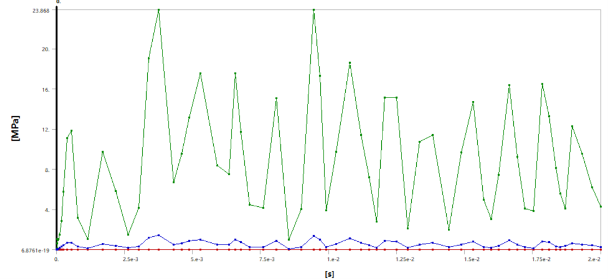
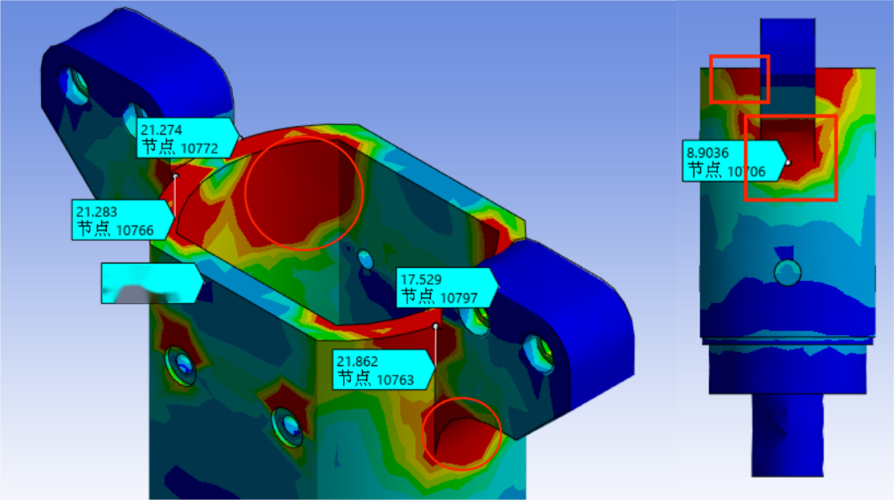
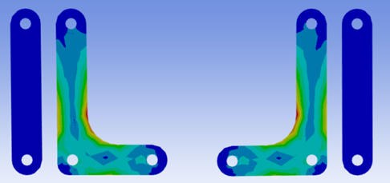

# Strength and Lightweight Analysis of High-Speed Rotating Component Load Units

This is the coursework for the Zhejiang University course Finite Element Analysis where we are required to apply the finite element analysis in some engineering problem.

## Background

Team member A designed a mechanical gripper system for rotating a Rubik's Cube during a Rubik's Cube robot competition. The key components of the mechanical gripper, such as the housing and connecting rods, were manufactured using 3D printing. While 3D printing offers the advantage of convenient shaping, it often suffers from unreliable strength. In this Rubik's Cube robot, the gripper's movement process can be roughly simplified into three stages: grabbing the Rubik's Cube, rotating the Rubik's Cube, and releasing the Rubik's Cube. In this finite element analysis, the team will focus on the core motion processes of the impact moment during the grab and the twisting rotation, in order to obtain stress and deformation states during these movements. Based on this, topology optimization, fatigue analysis, and other methods will be applied to optimize the structural design.

## Modeling and Material Settings

The basic principle of the mechanical gripper’s movement is that an internal induction coil (1) generates a magnetic field in opposite directions when energized, which acts on the magnetic elements (2) above to produce an axial driving force. This drives the four-bar mechanism to open and close the gripper. Meanwhile, the motor at the back drives the rotation of the robotic arm.

For material selection, it is noted that the Rubik's Cube and the internal induction coil (1) are not the primary objects of analysis, so equivalent methods are used. The materials of these two objects are set as PCB laminate material (PTFE) and copper alloy. The density parameters are adjusted based on volume and mass for approximate equivalence.

Density of Rubik's Cube:

$$
ρ_{Rubik’s Cube}=\frac{m}{V}=\frac{0.05}{0.055×0.055×0.055}=300.53 kg/m^3
$$

Density of Induction Coil:

$$
ρ_{Induction Coil}=\frac{m}{V}=\frac{0.26}{37073.5×10^{−9}}=7013.1 kg/m^3
$$

| Item                          | Parameter                                 | Comment                                     |
| ----------------------------- | ----------------------------------------- | ------------------------------------------- |
| 3D Printed Part               | Future 7500 high-performance nylon        | Detailed parameters are in the pdf document |
| Induction Coil (1) Mass       | 260g                                      |                                             |
| Induction Coil (1) Volume     | 37073.5$mm ^3 $                         |                                             |
| Electromagnetic Force         | 70N                                       |                                             |
| Rubik's Cube Size             | 55mm×55mm×55mm                          |                                             |
| Rubik's Cube Mass             | 50g                                       |                                             |
| Motor Torque                  | 2.2N·m                                   |                                             |
| Electromagnetic Coil Material | Copper Alloy, Density 7013.1kg/m³       | Detailed parameters in the appendix         |
| Rubik's Cube Material         | PCB Laminate (PTFE), Density 300.53kg/m³ | Detailed parameters in the appendix         |

## Modal Analysis Before Motion

The natural frequency of motor vibration and the internal spring can excite the mechanical gripper during motion. The reliability of the shell, one of the core components of the gripper, ensures its stability in such conditions. Therefore, a modal analysis was performed on the shell to determine its natural frequency, which will be used to avoid resonance during excitation in subsequent structural designs.

The constraints were applied to the motor connection side of the shell to simulate its working state for the modal analysis.

After computation, the natural frequencies of the shell were obtained, as shown below

| Mode                     | 1      | 2      | 3      | 4      | 5    | 6      | 7      | 8      | 9    | 10   |
| ------------------------ | ------ | ------ | ------ | ------ | ---- | ------ | ------ | ------ | ---- | ---- |
| **Frequency [Hz]** | 270.78 | 305.21 | 334.01 | 1255.8 | 1560 | 1817.9 | 2062.4 | 2326.5 | 2720 | 2841 |

Deformation modes for the six smallest modal frequencies are shown below

## Stress Concentration Analysis during Gripper's Grasping Impact

Using both transient and steady-state analysis methods, stress analysis was performed during the moment of grasping the Rubik's Cube.

### Transient Analysis

The transient analysis is computationally intensive, with relatively complex load conditions. Therefore, simplifications were made to the model's loading conditions and connectivity.

* The motor side of the mechanical gripper is fixed to the ground.
* The four-bar mechanism's connection (gripper, connecting rods, and housing) is simplified to rotational motion, allowing only axial rotation. The connection between the coil and the shell is simplified to eight rotational relationships
* A 70N electromagnetic attraction force was applied on the top surface of the coil and the force-bearing parts of the connecting rod.
* A friction coefficient of 0.15 was set for the contact between the Rubik's Cube and the gripper.

From the transient analysis results, it is evident that the impact happens very quickly, and each impact exhibits significant attenuation, ultimately achieving stable grabbing. Therefore, the subsequent analysis focuses on the stress concentration during the first impact.

Below is a simplified analysis showing the stress concentration during the first impact, when the maximum stress occurs

The stress concentration is mainly located at the ear portion of the shell and the connection region between the shell and the housing, with significant stress diffusion occurring.

Similarly, the stress concentration in the linkages can be analyzed to guide subsequent structural optimizations.

