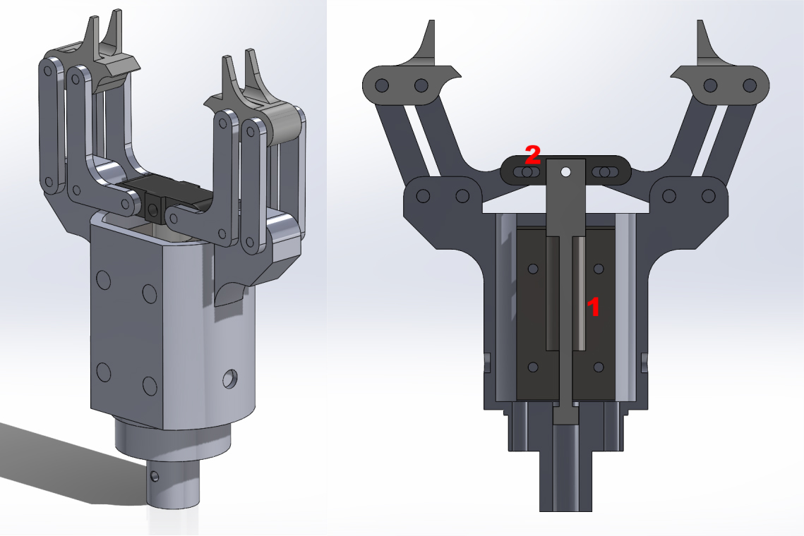

# Strength and Lightweight Analysis of High-Speed Rotating Component Load Units

This is the coursework for the Zhejiang University course Finite Element Analysis where we are required to apply the finite element analysis in some engineering problem.

## Background

Team member A designed a mechanical gripper system for rotating a Rubik's Cube during a Rubik's Cube robot competition. The key components of the mechanical gripper, such as the housing and connecting rods, were manufactured using 3D printing. While 3D printing offers the advantage of convenient shaping, it often suffers from unreliable strength. In this Rubik's Cube robot, the gripper's movement process can be roughly simplified into three stages: grabbing the Rubik's Cube, rotating the Rubik's Cube, and releasing the Rubik's Cube. In this finite element analysis, the team will focus on the core motion processes of the impact moment during the grab and the twisting rotation, in order to obtain stress and deformation states during these movements. Based on this, topology optimization, fatigue analysis, and other methods will be applied to optimize the structural design.

## Modeling and Material Settings

The basic principle of the mechanical gripper’s movement is that an internal induction coil (1) generates a magnetic field in opposite directions when energized, which acts on the magnetic elements (2) above to produce an axial driving force. This drives the four-bar mechanism to open and close the gripper. Meanwhile, the motor at the back drives the rotation of the robotic arm.
