# Strength and Lightweight Analysis of High-Speed Rotating Component Load Units

This is the coursework for the Zhejiang University course Finite Element Analysis where we are required to apply the finite element analysis in some engineering problem.

## Background

Team member A designed a mechanical gripper system for rotating a Rubik's Cube during a Rubik's Cube robot competition. The key components of the mechanical gripper, such as the housing and connecting rods, were manufactured using 3D printing. While 3D printing offers the advantage of convenient shaping, it often suffers from unreliable strength. In this Rubik's Cube robot, the gripper's movement process can be roughly simplified into three stages: grabbing the Rubik's Cube, rotating the Rubik's Cube, and releasing the Rubik's Cube. In this finite element analysis, the team will focus on the core motion processes of the impact moment during the grab and the twisting rotation, in order to obtain stress and deformation states during these movements. Based on this, topology optimization, fatigue analysis, and other methods will be applied to optimize the structural design.

## Modeling and Material Settings

The basic principle of the mechanical gripper’s movement is that an internal induction coil (1) generates a magnetic field in opposite directions when energized, which acts on the magnetic elements (2) above to produce an axial driving force. This drives the four-bar mechanism to open and close the gripper. Meanwhile, the motor at the back drives the rotation of the robotic arm.

For material selection, it is noted that the Rubik's Cube and the internal induction coil (1) are not the primary objects of analysis, so equivalent methods are used. The materials of these two objects are set as PCB laminate material (PTFE) and copper alloy. The density parameters are adjusted based on volume and mass for approximate equivalence.

Density of Rubik's Cube:

$$
ρ_{Rubik’s Cube}=\frac{m}{V}=\frac{0.05}{0.055×0.055×0.055}=300.53 kg/m^3
$$

Density of Induction Coil:

$$
ρ_{Induction Coil}=\frac{m}{V}=\frac{0.26}{37073.5×10^{−9}}=7013.1 kg/m^3
$$

| Item                          | Parameter                                 | Comment                                     |
| ----------------------------- | ----------------------------------------- | ------------------------------------------- |
| 3D Printed Part               | Future 7500 high-performance nylon        | Detailed parameters are in the pdf document |
| Induction Coil (1) Mass       | 260g                                      |                                             |
| Induction Coil (1) Volume     | 37073.5$mm ^3 $                         |                                             |
| Electromagnetic Force         | 70N                                       |                                             |
| Rubik's Cube Size             | 55mm×55mm×55mm                          |                                             |
| Rubik's Cube Mass             | 50g                                       |                                             |
| Motor Torque                  | 2.2N·m                                   |                                             |
| Electromagnetic Coil Material | Copper Alloy, Density 7013.1kg/m³       | Detailed parameters in the appendix         |
| Rubik's Cube Material         | PCB Laminate (PTFE), Density 300.53kg/m³ | Detailed parameters in the appendix         |

## Modal Analysis Before Motion

The natural frequency of motor vibration and the internal spring can excite the mechanical gripper during motion. The reliability of the shell, one of the core components of the gripper, ensures its stability in such conditions. Therefore, a modal analysis was performed on the shell to determine its natural frequency, which will be used to avoid resonance during excitation in subsequent structural designs.

The constraints were applied to the motor connection side of the shell to simulate its working state for the modal analysis.

After computation, the natural frequencies of the shell were obtained, as shown below

| Mode                     | 1      | 2      | 3      | 4      | 5    | 6      | 7      | 8      | 9    | 10   |
| ------------------------ | ------ | ------ | ------ | ------ | ---- | ------ | ------ | ------ | ---- | ---- |
| **Frequency [Hz]** | 270.78 | 305.21 | 334.01 | 1255.8 | 1560 | 1817.9 | 2062.4 | 2326.5 | 2720 | 2841 |

Deformation modes for the six smallest modal frequencies are shown below

## Stress Concentration Analysis during Gripper's Grasping Impact

Using both transient and steady-state analysis methods, stress analysis was performed during the moment of grasping the Rubik's Cube.

### Transient Analysis

The transient analysis is computationally intensive, with relatively complex load conditions. Therefore, simplifications were made to the model's loading conditions and connectivity.

* The motor side of the mechanical gripper is fixed to the ground.
* The four-bar mechanism's connection (gripper, connecting rods, and housing) is simplified to rotational motion, allowing only axial rotation. The connection between the coil and the shell is simplified to eight rotational relationships
* A 70N electromagnetic attraction force was applied on the top surface of the coil and the force-bearing parts of the connecting rod.
* A friction coefficient of 0.15 was set for the contact between the Rubik's Cube and the gripper.

From the transient analysis results, it is evident that the impact happens very quickly, and each impact exhibits significant attenuation, ultimately achieving stable grabbing. Therefore, the subsequent analysis focuses on the stress concentration during the first impact.

Below is a simplified analysis showing the stress concentration during the first impact, when the maximum stress occurs

The stress concentration is mainly located at the ear portion of the shell and the connection region between the shell and the housing, with significant stress diffusion occurring.

Similarly, the stress concentration in the linkages can be analyzed to guide subsequent structural optimizations.

### steady-state analysis

Based on the results of transient analysis and the physical model considerations, we explore whether we can approximate the impact process to a steady-state scenario, enabling the acquisition of high-precision results under lower computational power, which will guide subsequent analysis.

We observe that the stress concentration during the impact process follows a linear trend over time (though the magnitude of stress changes significantly, the stress distribution remains relatively constant throughout the process). During the first impact, a clear maximum stress occurs. We also note that the impact is caused by the sudden obstruction of the mechanical claw's movement by the cube, which leads to rapid deceleration, generating a significant force due to the large acceleration. Therefore, based on this analysis, we propose setting a constant force at the initial position of the mechanical claw and restricting the claw's motion, using the resulting stress conditions to approximate the stress under the impact situation. On this basis, all other forces are simplified, and components such as the electromagnet and shaft, which are not critical to the analysis, are removed.

In this simplification, we appropriately increase the connection complexity of the force-related parts of the model. The rotational components are modeled with pin connections, with a friction coefficient of 0.1.

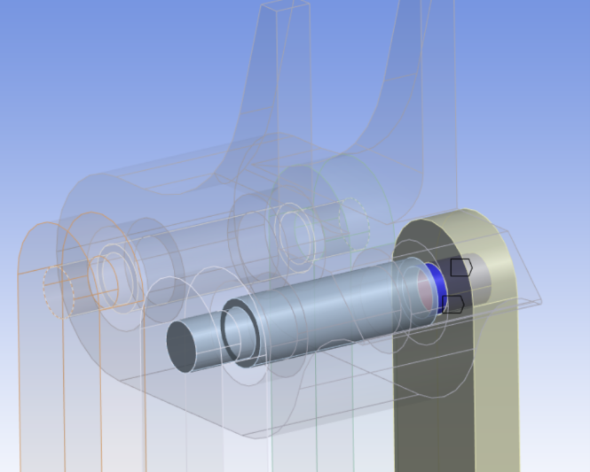

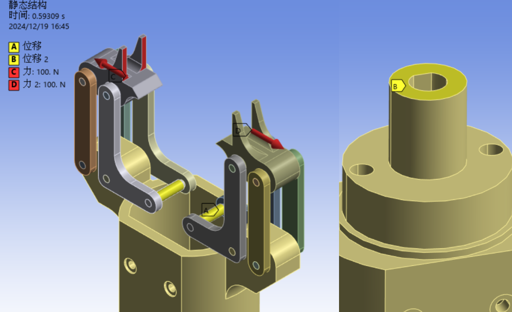

It is important to note that the exact force at the impact moment on the gripper cannot be directly calculated. Therefore, we referenced the maximum stress of about 23 MPa obtained from the transient analysis, and adjusted the corresponding equivalent load to ensure the stress at the original concentration location remains the same. This results in an equivalent force of about 135N at the gripper’s two ends. The transient analysis results at this stage (with a cell size of 1mm, providing much higher precision than the transient analysis) are shown below

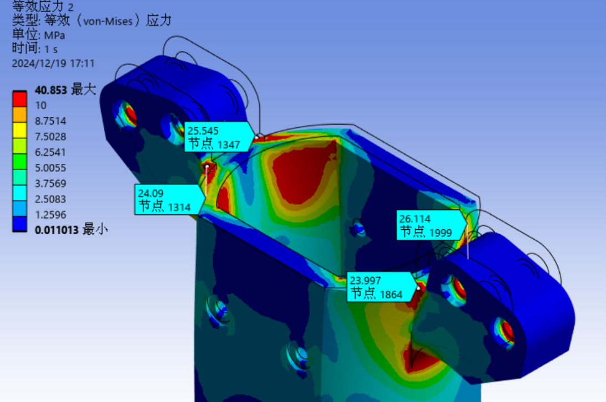

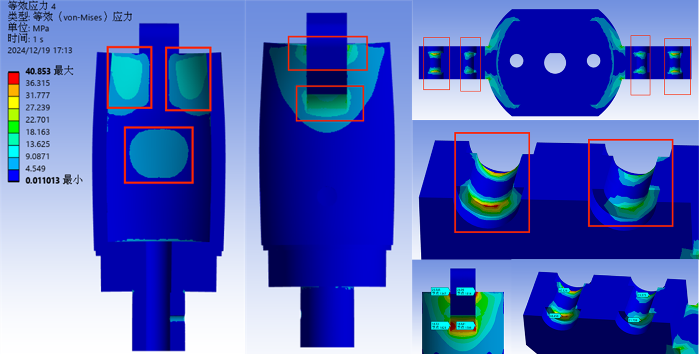

After adding pin connections and refining the mesh density, the stress analysis results are similar to those of the original transient analysis. However, the following changes occurred:

* The pin connection position replaced the original stress concentration location as the region with maximum stress, reaching 40 MPa.
* The stress at the lower half of the sleeve ear region increased, and a distribution of higher stress on both sides with a lower stress in the middle became evident.

This result shows that although the equivalent calculation provides a more detailed result, it still differs significantly from the real physical process. Thus, this method needs to be referenced dialectically.

The same method can be used to analyze the stress concentration in the linkage

As seen, the results are consistent with the transient analysis. The linkage experiences higher stress than the shell, reaching the maximum value at the connection point. Additionally, structural stress concentration appears at the inner arcs of the inner linkage, with significant severity. The outer linkage plays a limited role in distributing stress; most of the force is carried by the outer linkage. While the stress concentration regions are consistent, the result suggests that the outer linkage is crucial in stress transfer.

In general, although there are numerical differences between the two, steady-state analysis tends to overestimate the stress concentration compared to transient analysis. However, this more conservative estimation is useful for structural optimization, serving as a stricter basis for subsequent analysis.

## Stress Concentration Analysis during Gripper Rotation

After the gripper stabilizes the cube, it will grip it tightly with a 70N force using the electromagnet and begin rotating with a 2.2 N·m torque provided by the motor. The following analysis focuses on this process, where the steady-state equivalent provides poorer results and aligns less well with the actual model, so only transient analysis is conducted.

The settings are similar to those in the grabbing process transient analysis, where rotational relationships connect components. A 70N force is applied to the linkage's load-bearing end and the motor’s upper surface. The difference is that the cube’s axial displacement is set to zero, while displacement in the other two directions is allowed. The motor is fixed to the ground, providing a 2.2 N·m torque to rotate the gripper. The goal is to observe the changes in stress concentration during the rotation.

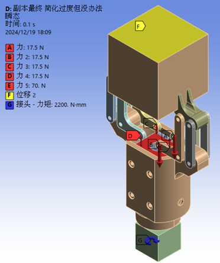

During calculation, the 70N load is applied in 0.005s to simulate a stable gripping state, followed by the application of the 2.2 N·m torque to start the gripper's rotation.

Since the gripper’s rotation angle generally does not exceed 180°, the study focuses on the first 90° rotation before deceleration is required.

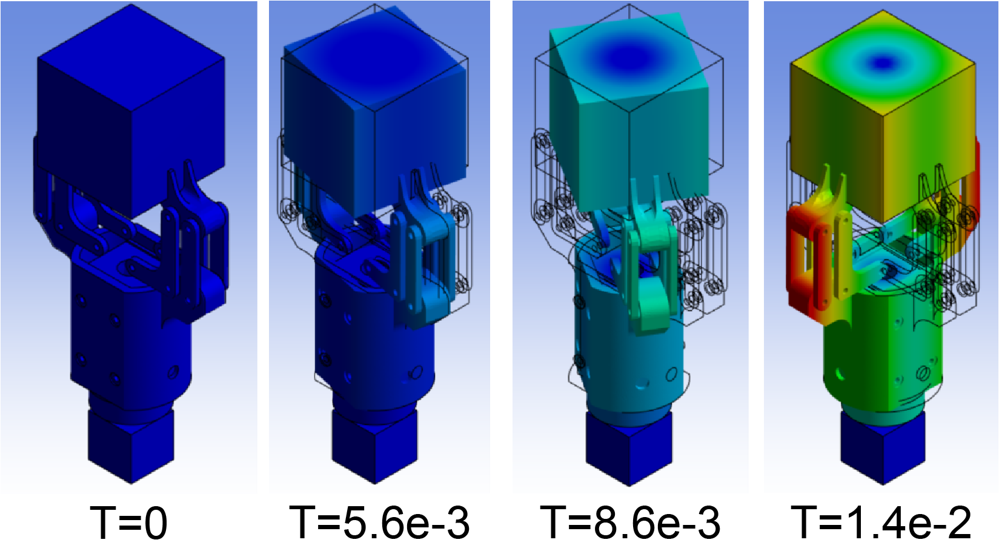

The stress distribution during the process from load application to rotation is as follows

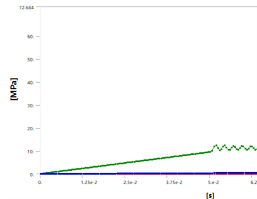

It can be seen that during rotation, the stress exhibits minor oscillations, with overall stress similar to that during the static gripping. This indicates that the rotation process, both during start-up and while ongoing, does not cause significant stress concentration.

A peak value moment is selected for further analysis of stress concentration during rotation.

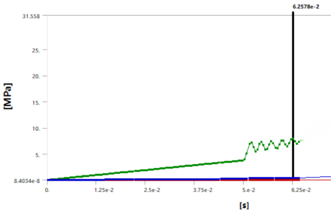

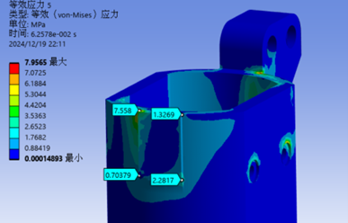

It can be seen that rotation causes the stress distribution to become distinctly asymmetric.

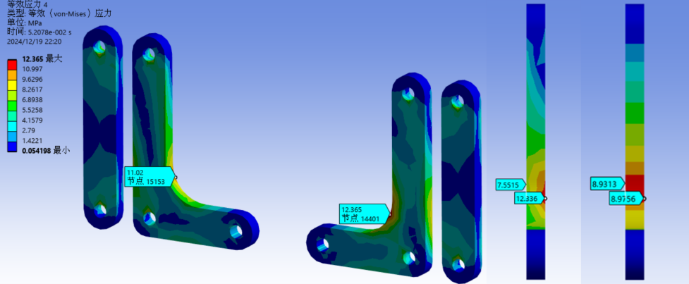

Maximum Stress Concentration Distribution for Linkage Structure (Left 1, 2) vs Gripping Stress Distribution (Right 1)

It is observed that the maximum stress concentration still occurs at the same location as during gripping or impact. However, due to rotation, there is a “transfer” of stress, leading to more severe concentration during rotation.

## Topology Optimization

Based on the analysis of the gripper's movement above, we conclude the following regarding stress concentration during the shell's movement

* The most significant stress concentration occurs during the impact process, with a maximum stress value of approximately 25 MPa, while the maximum stress during rotation is only 8 MPa.
* The steady-state equivalent of the impact process can effectively replace the transient analysis, despite some differences. The main stress concentration locations remain unchanged, though stress is higher in certain regions, effectively accounting for a safety factor. The steady-state analysis offers benefits such as easy integration into topology optimization, pin connections, increased mesh density, and significantly improved computational precision.

Therefore, steady-state analysis results serve as the basis for subsequent topology optimization.

Before topology optimization, areas where no material removal is required—such as interfaces with other parts like holes and shafts—are considered. After topology optimization and 14 iterations, the following result is obtained

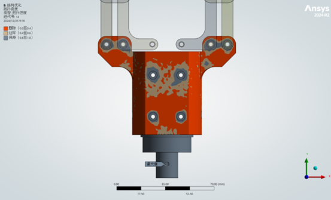

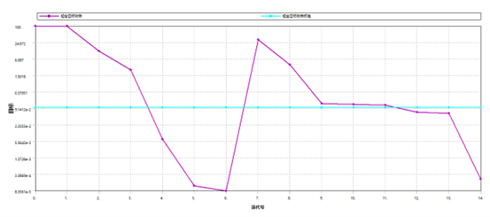

After removing the red “deleted” and brown “boundary” parts, the final result is as follows

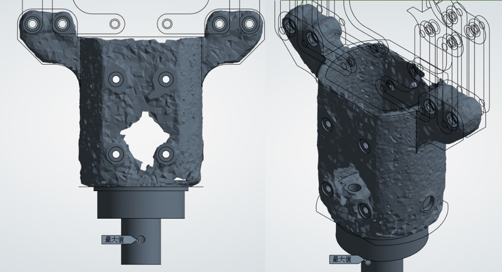

At this stage, the model is irregular. Using SpaceClaim, we repair and optimize it, saving the result as an STL file and importing it into slicing software.

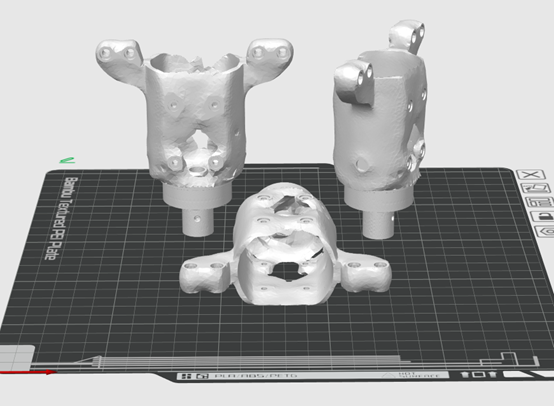

The optimized model was printed using the Bambu Lab X1E 3D printer. After removing the supports, the following product was obtained

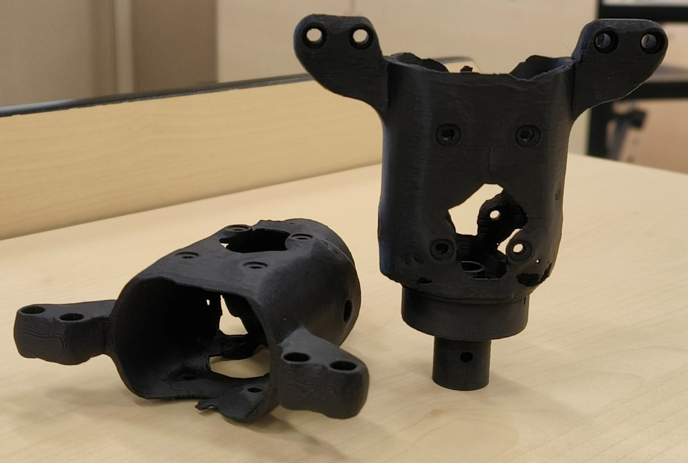

However, when the part was tested on the cube robot, it was found that the 3D printed part exhibited imbalance in rotational mass. This was due to the lack of symmetry constraints applied during topology optimization. Consequently, we considered using this part as a reference and manually modified the original model for weight reduction.

## Verification of Topology Optimized Structure and Reconstructed Model
